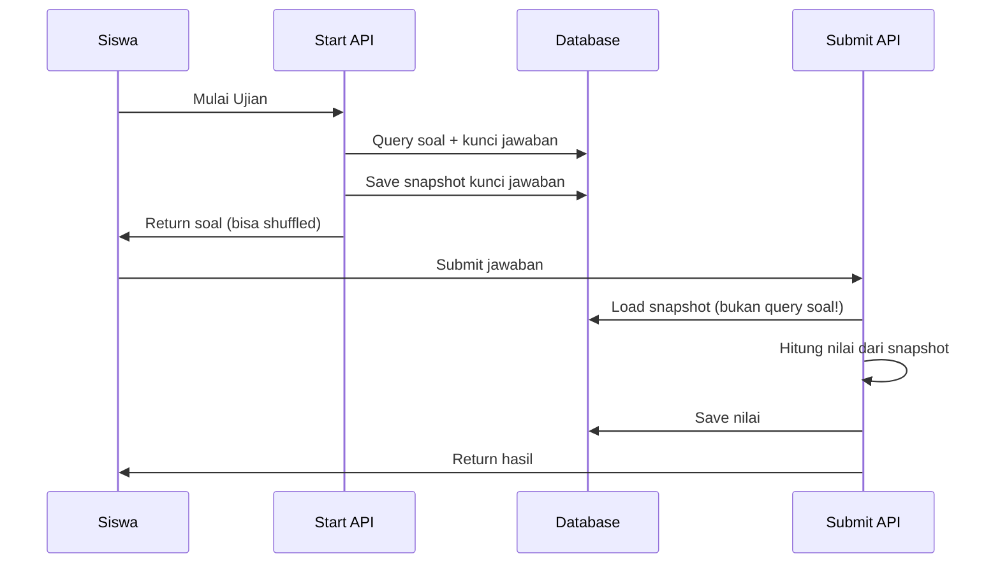
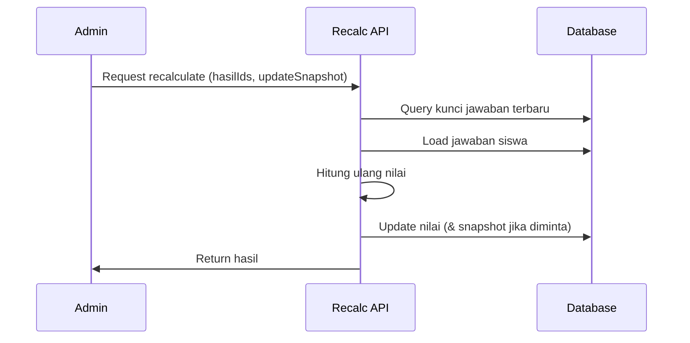

# Implementasi Snapshot Kunci Jawaban & Fix Recalculate

## 📋 Ringkasan

Implementasi sistem snapshot kunci jawaban untuk melindungi nilai siswa dari perubahan kunci jawaban soal, plus tool untuk recalculate nilai jika diperlukan.

## 🎯 Masalah yang Diselesaikan

**Sebelumnya:**
- Nilai siswa dihitung berdasarkan kunci jawaban real-time dari database
- Jika guru edit kunci jawaban setelah ujian, nilai siswa bisa berubah
- Tidak ada cara untuk fix nilai siswa yang terpengaruh

**Sekarang:**
- Kunci jawaban di-snapshot saat siswa mulai ujian
- Nilai siswa stabil, tidak terpengaruh perubahan kunci jawaban
- Ada tool "Fix & Recalculate" untuk recalculate nilai dengan kunci jawaban terbaru

## ✅ Yang Sudah Diimplementasi

### 1. Database Schema Update
- ✅ Tambah field `kunci_jawaban_snapshot` di tabel `hasil_ujian_peserta`
- ✅ Migration file dibuat: `drizzle/0016_add_kunci_jawaban_snapshot.sql`

### 2. Logic Snapshot Saat Start Ujian
- ✅ File: `src/app/api/ujian/[jadwalId]/start/route.ts`
- ✅ Snapshot kunci jawaban disimpan saat siswa pertama kali mulai ujian
- ✅ Format: `{ soalId: 'A'/'B'/'C'/'D'/'E' }`

### 3. Logic Grading Menggunakan Snapshot
- ✅ File: `src/app/api/ujian/[jadwalId]/submit/route.ts`
- ✅ Prioritas: snapshot > fallback ke real-time (backward compatibility)
- ✅ Logging untuk tracking apakah menggunakan snapshot atau fallback

### 4. API Recalculate
- ✅ File: `src/app/api/admin/hasil-ujian/recalculate/route.ts`
- ✅ Endpoint: `POST /api/admin/hasil-ujian/recalculate`
- ✅ Features:
  - Batch recalculate multiple hasil ujian
  - Option untuk update snapshot dengan kunci jawaban terbaru
  - Support untuk ujian dengan shuffled options

### 5. UI Fix & Recalculate Tool
- ✅ File: `src/app/admin/hasil-ujian/hasil/page.tsx`
- ✅ Features:
  - Checkbox untuk select multiple hasil ujian
  - Button "Fix & Recalculate" dengan badge counter
  - Dialog konfirmasi dengan warning & info
  - Option "Update Snapshot Kunci Jawaban"
  - Loading state & toast notification

## 🚀 Cara Menjalankan

### 1. Jalankan Migration Database

```bash
npm run db:push
```

Kemudian pilih "Yes, I want to execute all statements"

### 2. Restart Development Server (jika perlu)

```bash
npm run dev
```

### 3. Test Flow

#### A. Test Snapshot Baru (Ujian Baru)
1. Buat jadwal ujian baru
2. Siswa login dan mulai ujian → **Snapshot dibuat**
3. Siswa submit ujian → **Nilai dihitung dari snapshot**
4. Admin edit kunci jawaban di bank soal
5. Nilai siswa **tidak berubah** ✅

#### B. Test Recalculate
1. Buka halaman Admin > Hasil Ujian
2. Centang beberapa hasil ujian yang mau di-recalculate
3. Klik tombol "Fix & Recalculate"
4. Dialog muncul:
   - Baca warning & info
   - **Centang "Update Snapshot"** jika kunci jawaban sudah benar
   - Klik "Recalculate Sekarang"
5. Sistem recalculate nilai & update database
6. Refresh halaman → nilai sudah berubah ✅

## 📊 Cara Kerja Snapshot



## 🔧 Cara Kerja Recalculate



## 🎨 UI Components Baru

### 1. Button "Fix & Recalculate"
- Lokasi: Header halaman Hasil Ujian
- Warna: Orange (bg-orange-600)
- Icon: RefreshCw
- Disabled: jika tidak ada yang dipilih

### 2. Checkbox Selection
- Kolom baru di tabel hasil ujian
- Header checkbox: select/deselect all
- Badge counter: "{n} dipilih"

### 3. Recalculate Dialog
- Warning box (yellow): Perhatian tentang proses
- Info box (blue): Detail apa yang akan diproses
- Checkbox option: "Update Snapshot Kunci Jawaban"
- Button: Batal | Recalculate Sekarang

## 📝 Best Practices

### Kapan Recalculate?

✅ **LAKUKAN:**
- Saat ada kesalahan kunci jawaban yang sudah diperbaiki
- Saat perlu update nilai siswa dengan kunci jawaban terbaru
- **Centang "Update Snapshot"** setelah kunci jawaban dipastikan benar

❌ **JANGAN:**
- Recalculate tanpa alasan jelas (snapshot sudah melindungi nilai)
- Update snapshot jika belum yakin kunci jawaban benar
- Recalculate saat ujian masih berlangsung

### Workflow Ideal

1. **Sebelum Ujian**: Cek semua kunci jawaban sudah benar
2. **Saat Ujian**: Siswa mengerjakan, snapshot otomatis dibuat
3. **Setelah Ujian**: Nilai stabil, terlindungi dari perubahan
4. **Jika Ada Error Kunci**: 
   - Perbaiki kunci jawaban di bank soal
   - Select hasil ujian yang terpengaruh
   - Recalculate dengan "Update Snapshot" ✅

## 🐛 Troubleshooting

### Nilai tidak berubah setelah recalculate?
- Cek console log di browser (F12)
- Cek response API: `/api/admin/hasil-ujian/recalculate`
- Pastikan jawaban siswa tersimpan dengan benar

### Snapshot tidak tersimpan?
- Cek log saat siswa start ujian: `[SNAPSHOT] Created kunci jawaban snapshot`
- Cek database: field `kunci_jawaban_snapshot` harus terisi JSON

### Ujian lama (sebelum implementasi)?
- Ujian lama tidak punya snapshot
- Sistem akan fallback ke kunci jawaban real-time
- Aman, backward compatible ✅

## 📁 File yang Dimodifikasi

```
Modified:
✏️ src/db/schema.ts
✏️ src/app/api/ujian/[jadwalId]/start/route.ts
✏️ src/app/api/ujian/[jadwalId]/submit/route.ts
✏️ src/app/admin/hasil-ujian/hasil/page.tsx

Created:
✨ drizzle/0016_add_kunci_jawaban_snapshot.sql
✨ src/app/api/admin/hasil-ujian/recalculate/route.ts
✨ IMPLEMENTATION_SUMMARY.md (this file)
```

## 🎉 Selesai!

Sistem snapshot & recalculate sudah siap digunakan. Happy testing! 🚀
